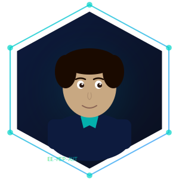

# Obadah Saleh — Portfolio Website

> Personal portfolio for **Obadah Saleh**, Electrical & MEP Engineer | MEP Coordinator | Industrial Automation Specialist — based in Dubai, UAE.

**Live site:** *obadah.qzz.io*  
**CV:** [https://1drv.ms/w/c/6745b9a1abfc6c22/IQADqJljhTcHQ5S8cKOOPXs2AT1mb1KWi67YuwMOurkyulg?e=v0iUd1](https://1drv.ms/w/c/6745b9a1abfc6c22/IQADqJljhTcHQ5S8cKOOPXs2AT1mb1KWi67YuwMOurkyulg?e=v0iUd1)
**LinkedIn:** [linkedin.com/in/obadahs](https://linkedin.com/in/obadahs)

---

## Table of Contents

- [Overview](#overview)
- [Features](#features)
- [File Structure](#file-structure)
- [Graphics & Assets](#graphics--assets)
- [Getting Started](#getting-started)
- [Deployment](#deployment)
- [Customization Guide](#customization-guide)
- [Design System](#design-system)
- [Browser Support](#browser-support)
- [Contact](#contact)

---

## Overview

A fully custom, single-page portfolio website built with **HTML5**, **CSS3**, and **JavaScript** — no frameworks, no dependencies, no build step required. Every file is self-contained and ready to open in a browser or upload to any static host.

The design language draws directly from electrical engineering: a dark navy base, teal and blue circuit-trace accents, monospace type for technical labels, and a hero background featuring custom SVG circuit board artwork. The result is a site that looks and feels like it belongs to an engineer, not a generic template.

---

## Features

### Visual & Animation
- **Circuit board hero** — custom SVG background with IC chip symbols, PCB trace paths, solder pads, and glow nodes
- **Particle canvas** — floating teal/blue particles with live connecting lines drawn on an HTML5 `<canvas>`, paused automatically when off-screen for performance
- **Typewriter effect** — cycles through four job titles in the hero with realistic typing and deletion speeds
- **Scroll reveal** — every section fades and slides up on enter using `IntersectionObserver` (no scroll event listeners)
- **Counter animation** — stat numbers in the hero count up with an eased animation when they enter the viewport
- **3D skill card tilt** — skill blocks rotate subtly in 3D following the mouse cursor using `perspective` transforms
- **Cursor glow** — a soft radial gradient follows the cursor across the page
- **Spinning avatar orbit ring** — decorative ring around the profile image animates continuously
- **Floating badge** — "Open to opportunities" badge bobs with a smooth float animation

### Navigation & UX
- **Sticky glassmorphism navbar** — transparent on load, blurs and gains a border on scroll
- **Active section highlighting** — current section link in the nav turns teal as you scroll, tracked via `IntersectionObserver`
- **Smooth scroll** — all anchor links scroll smoothly with a fixed navbar offset applied
- **Mobile hamburger menu** — animated three-line toggle that opens a full-width mobile nav
- **Experience tab switcher** — click between Ashiyana Contracting and Sofcon India to reveal the relevant role details and projects

### Content Sections
| Section | Description |
|---|---|
| **Hero** | Name, animated title, description, CTA buttons, stat counters |
| **About** | Bio, avatar, availability badge, keyword tags |
| **What I Do** | Four service cards covering MEP Coordination, Electrical Engineering, Industrial Automation, and T&C |
| **Skills** | Bento-grid layout with 6 skill blocks and 40+ categorised skill pills |
| **Experience** | Tabbed panel for Ashiyana Contracting (current) and Sofcon India, with responsibilities and project listings |
| **Education & Certs** | B.Tech degree card and four certification entries |
| **Contact** | Email, phone, LinkedIn, CV links — with live availability indicator |

---

## File Structure

```
obadah-portfolio/
│
├── index.html          # Main HTML — all content and page structure
├── style.css           # All styles — design tokens, layout, animations, responsive
├── script.js           # All JavaScript — animations, interactions, canvas, tabs
│
├── circuit-bg.svg      # Hero background — custom circuit board artwork
├── avatar.svg          # Profile graphic — hexagonal engineering avatar
└── skill-icons.svg     # Icon set — 5 discipline icons (reference / optional use)
```

All six files must be kept in the **same directory** for the site to work correctly. There are no external file dependencies beyond Google Fonts, which loads via CDN.

---

## Graphics & Assets

Three original SVG graphics are included — all created specifically for this portfolio:

### `circuit-bg.svg`
The hero section background. Features a dark navy canvas with:
- A fine grid of faint lines suggesting a PCB substrate
- Teal and blue polyline circuit traces with 90-degree routing typical of PCB design
- Circular solder pads and glowing junction nodes with radial gradient halos
- Three IC chip outlines labelled `SYS`, `PLC`, and `MEP`
- Capacitor symbols and atmospheric elliptical glows

### `avatar.svg`
A hexagonal framed profile avatar styled for a technical identity. Features:
- Hexagonal border with teal gradient accent stroke and corner node dots
- A professional illustrated figure with jacket and teal tie accent
- `EE-MEP-AUT` label tag at the base

### `skill-icons.svg`
A horizontal icon strip with five circular discipline icons:
- ⚡ Lightning bolt — Electrical
- ⚙ Gear with pins — MEP
- 🔲 IC chip — Automation
- 🧊 Isometric cube — BIM/CAD
- 〜 Waveform — Testing & Commissioning

To swap the avatar for a real photo, replace the `` in `index.html` with an `` pointing to your photo file, and keep the same class `avatar-wrap` structure.

---

## Getting Started

### View locally

No installation or build step needed. Simply open the file in a browser:

```bash
# Option 1 — double-click index.html in your file manager

# Option 2 — open from terminal (macOS)
open index.html

# Option 3 — open from terminal (Linux)
xdg-open index.html

# Option 4 — use a local dev server (recommended to load fonts correctly)
npx serve .
# or
python3 -m http.server 8080
# then visit http://localhost:8080
```

> **Note:** Google Fonts load via CDN. If you are offline, the site falls back to system sans-serif fonts. Running via a local server rather than `file://` avoids any browser CORS restrictions on SVG loading.

---

## Deployment

This is a static site — it can be deployed anywhere that serves HTML files.

### Netlify (recommended — free)
1. Go to [netlify.com](https://netlify.com) and sign in
2. Drag and drop the entire `obadah-portfolio/` folder onto the Netlify dashboard
3. Your site is live instantly with a `.netlify.app` URL
4. Optionally connect a custom domain in Site Settings

### GitHub Pages
1. Create a new repository on GitHub (e.g. `obadah-portfolio`)
2. Push all six files to the `main` branch
3. Go to **Settings → Pages → Source** and select `main` / `root`
4. GitHub will publish the site at `https://yourusername.github.io/obadah-portfolio/`

### Vercel
```bash
npm install -g vercel
cd obadah-portfolio
vercel
```

### Manual / cPanel Hosting
Upload all six files into the `public_html` directory (or the relevant web root) via FTP or the cPanel File Manager. Ensure `index.html` sits at the root level.

---

## Customization Guide

### Update contact details
In `index.html`, search for the following and replace with your latest information:

| What | Where to find it |
|---|---|
| Email address | `href="mailto:salehobadah@gmail.com"` and visible text in Contact section |
| Phone number | `href="tel: +971564738143"` and visible text |
| LinkedIn URL | `href="https://linkedin.com/in/..."` (appears twice — nav CTA and Contact) |
| CV link | `href="https://bit.ly/obadahpro"` (appears twice — hero and Contact) |

### Add or remove skill pills
In `index.html`, find the relevant `<div class="skill-block">` and add or delete `<span class="skill-pill">Your Skill</span>` elements inside the `.skill-pills` div.

### Add a new Experience tab
1. In the `.exp-tabs` div, copy an existing `<button class="exp-tab">` block and give it a new `data-tab="yourkey"` value
2. In `.exp-panels`, copy an existing `<div class="exp-panel">` block, change its `id` to `panel-yourkey`, and update the content

### Change the typewriter phrases
In `script.js`, find the `phrases` array near the top of the `typewriter` function and edit the strings:

```js
const phrases = [
  'Electrical & MEP Engineer',
  'MEP Coordinator',
  'Industrial Automation Specialist',
  'BIM / Revit Engineer'
];
```

### Swap in a real profile photo
Replace the avatar image reference in `index.html`:

```html
<!-- Before -->


<!-- After -->

```

Add your photo file to the same folder as `index.html`.

### Update the hero stat counters
Find the four `.stat` blocks in the Hero section of `index.html`. Change the `data-count` value to update what the counter animates to, and the `data-suffix` for a unit (e.g. `+`, `%`):

```html
<span data-count="2" data-suffix="+">0+</span>
```

---

## Design System

All visual decisions are controlled by CSS custom properties at the top of `style.css`. Change these to retheme the entire site:

```css
:root {
  --bg:        #0A0F1E;   /* Page background — deep navy */
  --bg-card:   #0D1525;   /* Card backgrounds */
  --bg-hover:  #111D35;   /* Hover state backgrounds */
  --teal:      #00D4C8;   /* Primary accent — teal */
  --blue:      #4A9EFF;   /* Secondary accent — blue */
  --muted:     #8892A4;   /* Subdued text, labels */
  --border:    #1A2540;   /* Dividers and card borders */
  --text:      #F0F4FF;   /* Primary text */
  --text-dim:  #B0BAD0;   /* Body text */
  --grad:      linear-gradient(135deg, #00D4C8, #4A9EFF);  /* Accent gradient */
  --font-disp: 'Syne', sans-serif;          /* Display / headings */
  --font-body: 'Inter', sans-serif;         /* Body text */
  --font-mono: 'JetBrains Mono', monospace; /* Code labels, tags */
}
```

**Typography scale** — Syne (display, geometric, strong personality) paired with Inter (neutral, highly legible body) and JetBrains Mono (technical labels, tags, nav links). This pairing was chosen to reflect precision engineering — structured and readable, but with a distinctive technical character.

---

## Browser Support

| Browser | Support |
|---|---|
| Chrome / Edge (latest) | ✅ Full |
| Firefox (latest) | ✅ Full |
| Safari 15+ | ✅ Full |
| Mobile Chrome / Safari | ✅ Full (responsive down to 360px) |
| IE 11 | ❌ Not supported |

The site respects `prefers-reduced-motion` — users with that system preference set will see no animations, complying with accessibility best practice.

---

## Contact

**Obadah Saleh**  
Electrical & MEP Engineer · Dubai, UAE

📧 salehobadah@outlook.com  
📞 +971 564 738 143  
🔗 [linkedin.com/in/obadahs](https://linkedin.com/in/obadahs)  
📄 [https://1drv.ms/w/c/6745b9a1abfc6c22/IQADqJljhTcHQ5S8cKOOPXs2AT1mb1KWi67YuwMOurkyulg?e=v0iUd1](https://1drv.ms/w/c/6745b9a1abfc6c22/IQADqJljhTcHQ5S8cKOOPXs2AT1mb1KWi67YuwMOurkyulg?e=v0iUd1)

---

*Built with HTML, CSS, and JavaScript — no frameworks.*
